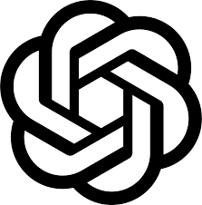

<!-- Banner -->

  
  
  
  

## 🛠️ Tech Stack

### Languages

### Frameworks & Runtime

### Mobile & Desktop

### Database & Infra

### AI & Tools

<table>
  <tr>
    <td align="center" width="90">
      
       OpenAI
    </td>
    <td align="center" width="90">
      
       DeepSeek
    </td>
    <td align="center" width="90">
      
       LangChain
    </td>
    <td align="center" width="90">
      
       HuggingFace
    </td>
    <td align="center" width="90">
      
       Ollama
    </td>
    <td align="center" width="90">
      
       TensorFlow
    </td>
    <td align="center" width="90">
      
       PyTorch
    </td>
  </tr>
</table>

---

## 📊 GitHub Stats

---

## 📈 Activity Overview

---

## 🐍 Contribution Graph

---

## 🤖 Agentic AI Workflow

Query → Reason → Plan → Execute → Remember → Guard → Output

---

## 🤝 Let's Connect

